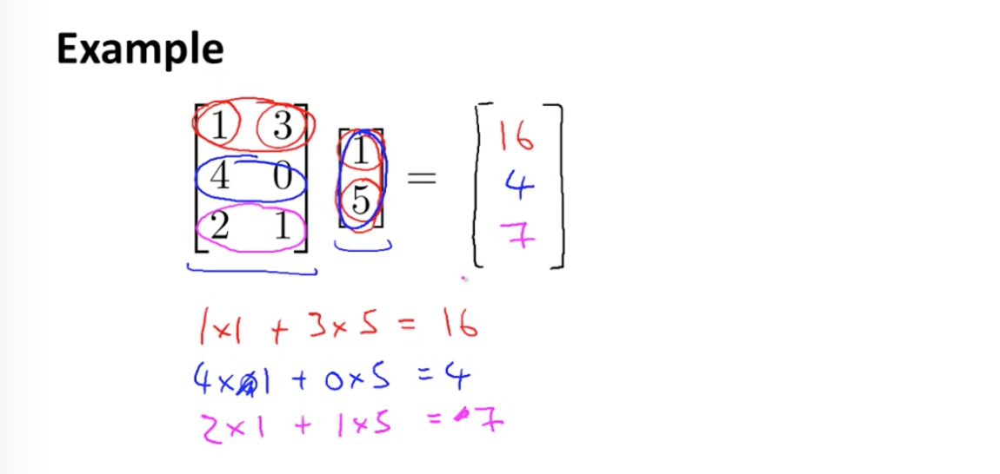
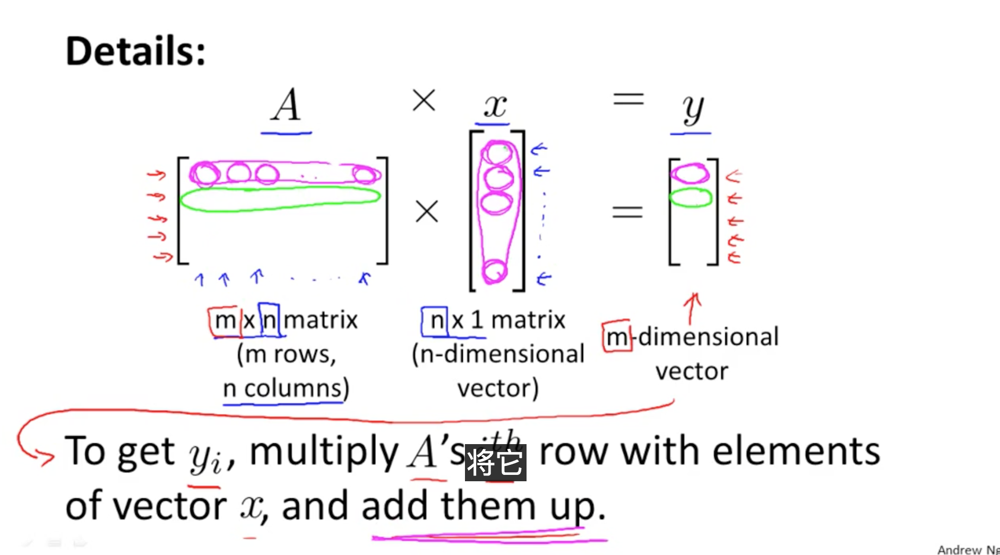
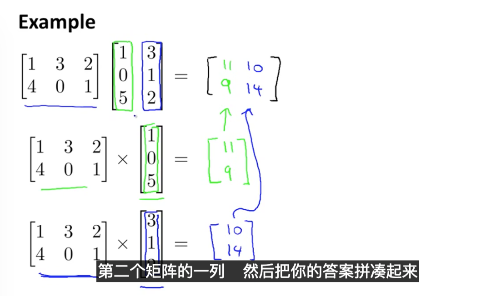
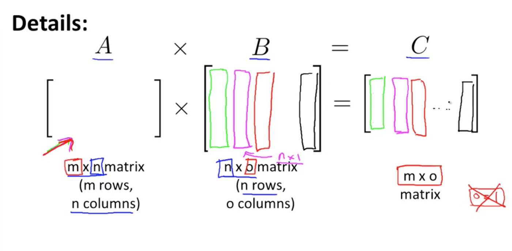
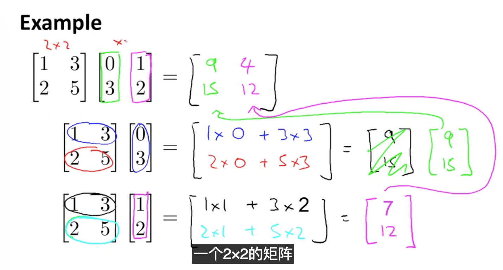

### 1. Supervised Learning

##### 1.1 Define:

​	given a data set and already know waht out correct output should look like, that is given `correctted answer.`


##### 1.2 Regression: Predict `continuous valued` output

map input variables to some continuous function

```
e.g.
Regression - Given a picture of a person, we have to predict their age on the basis of the given picture
```

`Question:`

what is define of `continuous value???`


##### 1.3 Classification: `Discrete valued` output ( 0 or 1 )

`Question:`

the discrete value only have two different type value? like 0 or 1.

```
e.g.
Given a patient with a tumor, we have to predict whether the tumor is malignant or benign.
```

###  2. Unsupervised Learning

### 3. Model and Cost Function

##### 3.1 Model Representation

`Hypothesis function:`

##### 3.2 Cost Function

`Cost Funcition:`

`gradient descent:`


### 4. Linear Algebra Review

##### 4.1 Matrices and Vectors

**`Matrices:`**  An **n x m** array

**Add:** must have the same dimension.

**Scalar Multiplication:**  a real number 


**`Vectors:`**  An **n x 1** matrix


##### 4.2 Math Operations

**`Matrix Vector` Multiplication:**  






**`Matrix Matrix` Multiplication**









##### 4.3 Properties

**`not commutative`**

