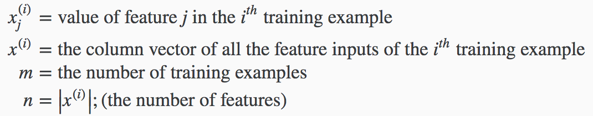
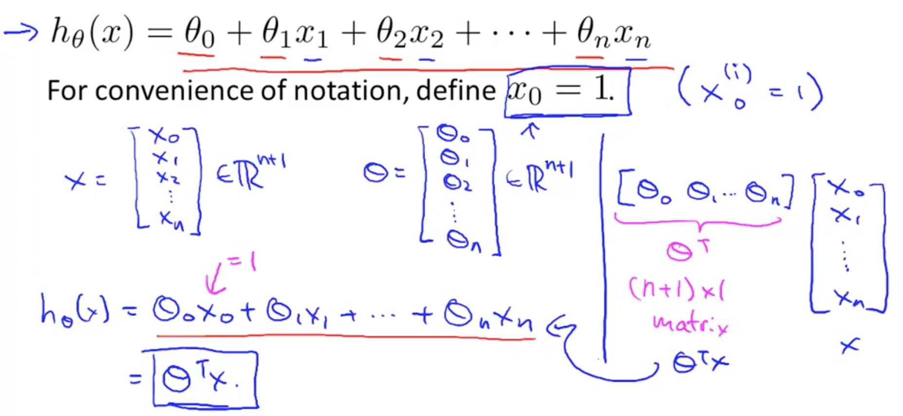
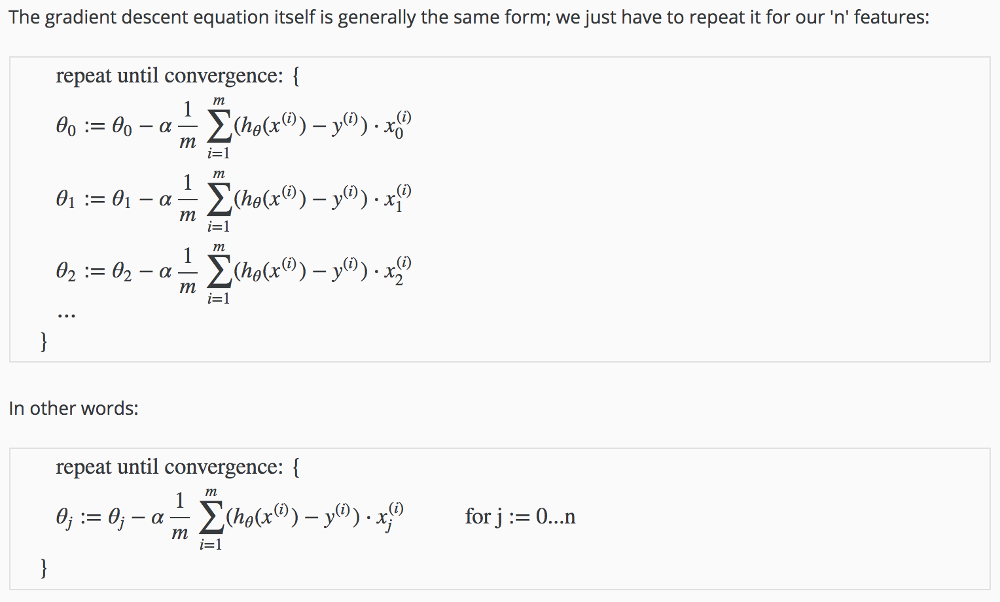
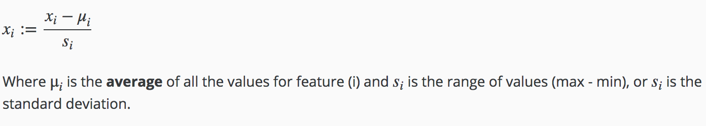
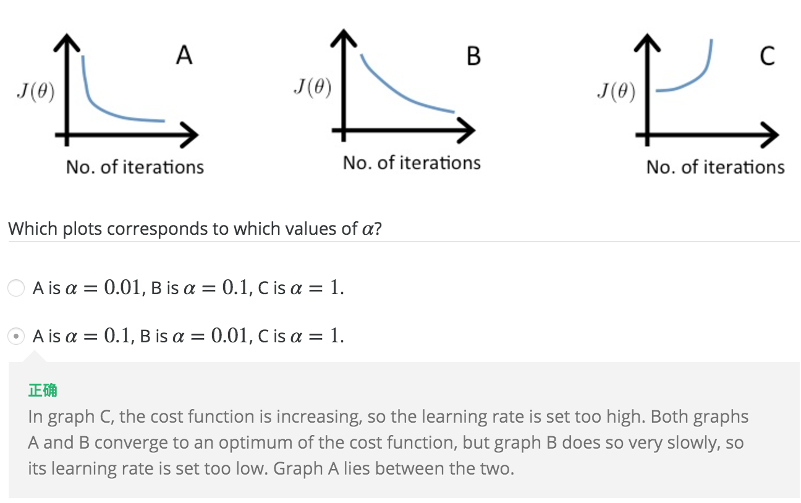
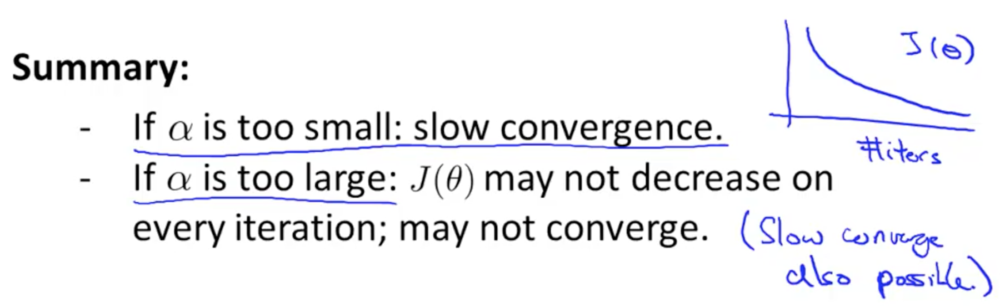
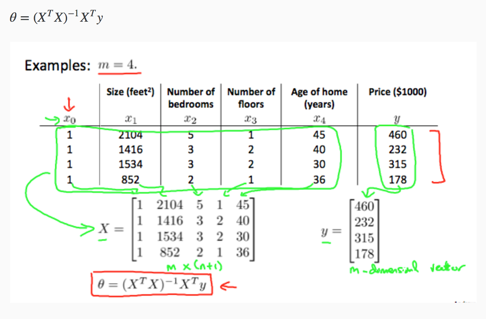
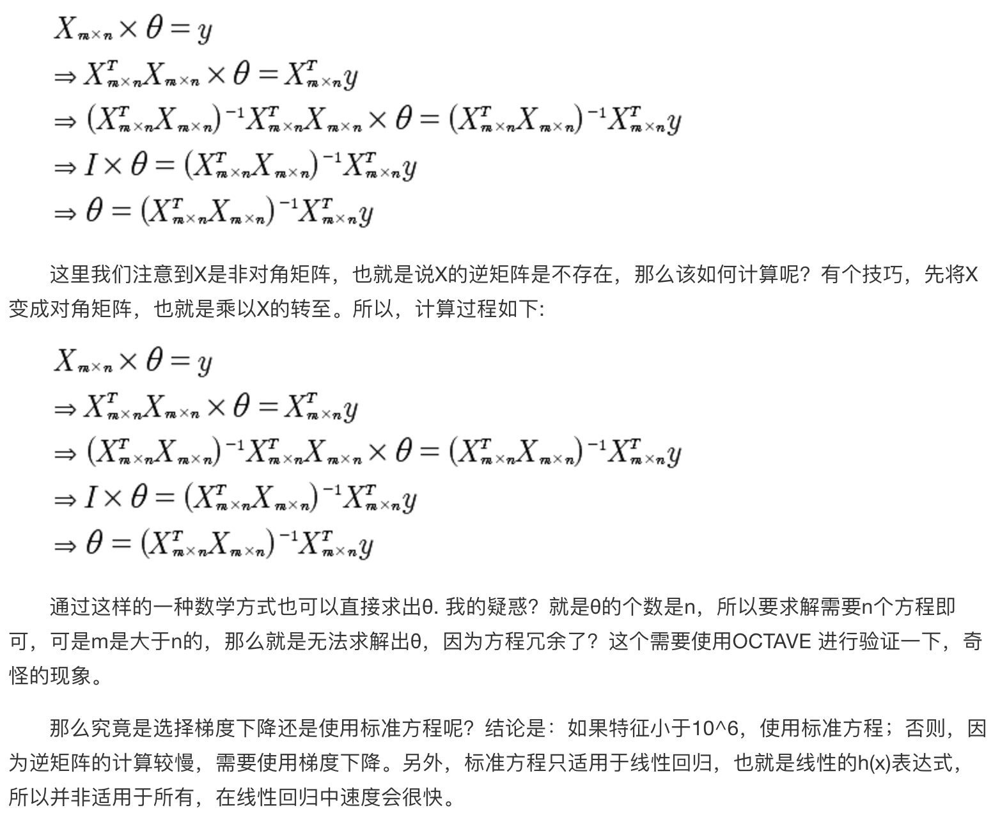

### 2. Multivariate Linear Regression

##### 2.1 Notation:

​    

##### 2.2 Hypothesis:

##### 2.3 Gradient Descent for Multiple Variables

##### 2.4.1 Feature Scaling 缩放

Feature scaling involves dividing the input values by the range of the input variable, resulting in a new range of **just 1**.

Get every feature into approximately a `-1 <= xi <= 1` range.
$$
normalized (x)= \frac {x-u} s \\ where u = mean(x) \\ s = range(max - min)
$$

##### 2.4.2 Mean Normalization 

Mean Normalization involves substracting the average value of an input variable form the values for that input variable resulting in a new average value for the input variable of just **zero**.

Replace `xi` with `xi - ui` to make features have approximately **zero mean** (Do not apply `x0` = 1)

​	`normalize(x) = (x - (a+b)/2) / (b-a), x∈[a, b]`  -0.5 ~ +0.5

​	

##### 2.4.3 Learning Rate

##### 2.5 Normal Equation

##### 2.5.1 Design Matrix `X`

The X matrix is `(n+ 1)` by `(n+1)` and **NOT** `n` by `n`.

In the 'Normal Equation' method, we will minimize `J` by explicitly taking its derivatives(导数) with respect to the `θj’s`, and setting them to zero. This allows us to find the optimum theta without iteration. The normal equation formula is given below:
$$
(X^TX)^{-1} 是转置矩阵，表达式为：pinv(X'*X)
$$

**对角矩阵(diagonal matrix)**是一个主对角线之外的元素皆为0的矩阵。对角线上的元素可以为0或者其他值。
$$
\begin{bmatrix} 1 & 0 & 0 \\ 0 & 2 & 0  \\0 & 0 & 3  \end{bmatrix}
$$

##### 2.5.2 Compare

| Gradient Descent                 | Normal Equation                          |
| -------------------------------- | ---------------------------------------- |
| Need to choose `alpha`           | No need to choose `alpha`                |
| Needs many iterations            | Don't need to iterate                    |
| Work well even when `n` is large | Need to computer `(X^-1X)^-1`            |
|                                  | Slow if `n` is very large                |
| O(kn^2)                          | O(n^3), need to calculate inverse of `X^T*X` |

##### 2.5.3 Non-invertible (singular/degenerate)

1. Redundant features, where two features are very closely related (i.e. they are linearly dependent)
2. Too many features (e.g. m <= n). In this case, delete some features or use "Regularization"

##### 2.6 Vectorization 

$$
J(\theta) = {1\over 2m} \sum_{i=0}^{n} (h_\theta(x^{(i)}) - y^{(i)})^2
$$

The cost function can also be written in the following vectorized form,
$$
J(\theta) = {1 \over 2m}(X\theta - \vec{y})^T (X\theta - \vec{y})  
$$
where
$$
{\vec y} = \begin{bmatrix} y^{(1)}\\y^{(2)}\\...\\y^{(m)}\end{bmatrix} \\
X = \begin{bmatrix} (x^{(1)})^T\\(x^{(2)})^T\\...\\(x^{(m)})^T\end{bmatrix}
$$

##### 2.7 

$$
X = \begin{bmatrix}  (x^{(1)})^T \\ (x^{(2)})^T \\ ... \\ (x^{(m)})^T  \end{bmatrix} = \begin{bmatrix} x^{(1)}_0 & x^{(1)}_1 & ... & x^{(1)}_n \\ x^{(2)}_0 & x^{(2)}_1 & ... & x^{(2)}_n  \\ ... & ... & ... & ... \\ x^{(m)}_0 & x^{(m)}_1 & ... & x^{(m)}_n  \end{bmatrix}, y = \begin{bmatrix} y^{(1)} \\ y^{(2)} \\ ... \\ y^{(m)}\end{bmatrix}
$$

$$
x^{(i)} = \begin{bmatrix} x^{(i)}_0 \\ x^{(i)}_1 \\ x^{(i)}_2 \\ ... \\ x^{(i)}_n  \end{bmatrix} \in R^{n+1}, (x^{(i)})^T = \begin{bmatrix} (x^{(i)}_0)^T & (x^{(i)}_1)^T & (x^{(i)}_2)^T & ... & (x^{(i)}_n)^T  \end{bmatrix}
$$

$$
\theta = \begin{bmatrix} \theta_0 \\ \theta_1 \\ ... \\ \theta_n\end{bmatrix}, \theta^T = \begin{bmatrix} \theta_0 & \theta_1 & ... & \theta_n\end{bmatrix}
$$

$$
h_\theta(x) = \sum_{j=0}^n {\theta_j}{x_j^i} = \theta^T x^i = \begin{bmatrix} \theta_0 & \theta_1 & ... & \theta_n\end{bmatrix} * \begin{bmatrix} x^{(i)}_0 \\ x^{(i)}_1 \\ x^{(i)}_2 \\ ... \\ x^{(i)}_n  \end{bmatrix} = real\_number
$$

​					
$$
h_\theta(X) = X * \theta = \begin{bmatrix} x^{(1)}_0 & x^{(1)}_1 & ... & x^{(1)}_n \\ x^{(2)}_0 & x^{(2)}_1 & ... & x^{(2)}_n  \\ ... & ... & ... & ... \\ x^{(m)}_0 & x^{(m)}_1 & ... & x^{(m)}_n  \end{bmatrix} * \begin{bmatrix} \theta_0 \\ \theta_1 \\ ... \\ \theta_n\end{bmatrix} \\ = \begin{bmatrix} x^1_0 * \theta_0 + x^1_1 * \theta_1 + ... + x^1_n * \theta_n \\ x^2_0 * \theta_0 + x^2_1 * \theta_1 + ... + x^2_n * \theta_n \\ ... \\ x^m_0 * \theta_0 + x^m_1 * \theta_1 + ... + x^m_n * \theta_n\end{bmatrix} = vector
$$
​		
$$
h_\theta(x^{(i)} - y^{(i)}) = h_\theta(X) - \vec{y} = \begin{bmatrix} x^1_0 * \theta_0 + x^1_1 * \theta_1 + ... + x^1_n * \theta_n \\ x^2_0 * \theta_0 + x^2_1 * \theta_1 + ... + x^2_n * \theta_n \\ ... \\ x^m_0 * \theta_0 + x^m_1 * \theta_1 + ... + x^m_n * \theta_n\end{bmatrix} - \begin{bmatrix} y^{(1)} \\ y^{(2)} \\ ... \\ y^{(m)}\end{bmatrix} = \begin{bmatrix} e^{(1)} \\ e^{(2)} \\ ... \\ e^{(m)}\end{bmatrix} = vector
$$

$$
\frac{1}{m} \sum_{i=1}^m(h_\theta(x^{(i)}) - y^{(i)})x^{(i)}_j  \space\space\space\space\space\space\space(for\_all\_j, j \in [0, n+1])
\\ = (h_\theta(X) - \vec{y})^T * X / m = (X * \theta - \vec{y})^T * X / m
$$
